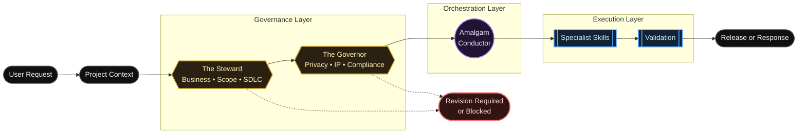

<div align="center">
  

  <p>
    <strong>Project-agnostic governance and orchestration framework for AI-assisted development.</strong>
  </p>

  <p>
    <a href="docs/setup/INSTALLATION.md">Installation</a> •
    <a href="docs/governance/GOVERNANCE_LAYER.md">Governance</a> •
    <a href="SKILL_INDEX.md">Skills</a> •
    <a href="docs/setup/VALIDATION.md">Validation</a>
  </p>
</div>

---

## At a Glance

| Layer | Role | Purpose |
|---|---|---|
| Governance | The Steward | Business, scope, SDLC, requirements, and value alignment |
| Governance | The Governor | Legal risk, privacy, IP, licensing, security, and compliance review |
| Orchestration | Amalgam Conductor | Routes approved work to the correct specialist skills |
| Execution | Specialist Skills | Performs focused implementation, documentation, QA, security, or design work |

## Core Concept

Amalgam Conductor uses a governance-first workflow, but the governance layer does not assume what rules apply to every project. Before review, The Steward and The Governor identify the project context, declared objectives, release target, data use, dependencies, documentation requirements, and known constraints. The Steward then checks alignment against the project’s stated goals, scope, requirements, acceptance criteria, and SDLC needs. The Governor checks only the applicable legal-risk, privacy, IP, licensing, security, and compliance areas based on the supplied project context. If the scope is unclear, governance returns REVISION_REQUIRED instead of assuming.

## Usage Pattern

### 1. Start with a project context

The governance layer does not assume what rules apply. Users should provide enough context for The Steward and The Governor to know what they are reviewing.

Minimum context:

| Context Item | What to Provide |
|---|---|
| Project Type | School project, internal tool, open-source repo, client app, public product, data project, AI workflow |
| Goal | What the task should accomplish |
| Release Target | Local only, internal use, public release, client delivery, open-source release |
| Data Use | No user data, test data, personal data, sensitive data, uploaded files, third-party data |
| Dependencies | Libraries, assets, APIs, models, datasets, or third-party content involved |
| Constraints | Files to preserve, style rules, framework limits, legal or policy boundaries |
| Expected Output | Changed files, summary, validation results, risks, next step |

### 2. Use the standard prompt pattern

Add this template to the top of your request:

```text
[@ponytail] use amalgam-conductor for this task

Project Context:
Project Type:
Goal:
Release Target:
Data Use:
Dependencies or Third-Party Assets:
Constraints:

Task:
Describe the work clearly.

Requirements:
- List what must be changed.
- List what must be preserved.
- List any rules the implementation must follow.

Expected Output:
Changed Files:
Summary:
Validation Results:
Remaining Risks:
Next Recommended Step:
```

### 3. Let governance classify the request

The Steward and The Governor first establish the Governance Basis of Review. They use the supplied context to decide whether the request is LOW, MEDIUM, or HIGH risk.

They do not apply every governance rule to every task.

- If context is missing, they return:
  `Decision: REVISION_REQUIRED`
- If a risk area does not apply, they return:
  `Decision: NOT_APPLICABLE`
- If work can proceed, they return:
  `Decision: APPROVED`
- If work should not proceed, they return:
  `Decision: BLOCKED`

### 4. Interpret the decision

| Decision | Meaning | User Action |
|---|---|---|
| **APPROVED** | Work can proceed | Let the conductor route the task |
| **REVISION_REQUIRED** | More context or correction is needed | Add missing details and resubmit |
| **BLOCKED** | Work should not proceed as requested | Resolve the blocking issue first |
| **NOT_APPLICABLE** | Governance check is not needed for this task | Continue with the fast path |

### 5. Review the IDE output

The AI will output your changes using this expected format:

```text
Changed Files:
Summary:
Validation Results:
Remaining Risks:
Next Recommended Step:
```

### 6. Iterate

Follow this feedback loop:
1. Draft or refine the prompt in chat.
2. Send the refined prompt to the IDE.
3. Let the IDE inspect files and propose changes.
4. Review changed files and validation results.
5. Approve, revise, or ask for another iteration.
6. Commit only after validation passes.

### 7. When to use Amalgam Conductor

Use Amalgam Conductor for:
- Multi-file changes.
- Architecture changes.
- Governance-sensitive work.
- Documentation and implementation updates.
- Public release preparation.
- Tasks involving user data, licensing, privacy, security, or compliance.
- Cross-domain tasks.

### 8. When to use a specialist directly

Use a specialist directly when the task is narrow and obvious:
- UI only.
- Documentation only.
- SQL only.
- QA only.
- Security evidence only.
- Diagram only.

> [!NOTE]
> When unsure, start with Amalgam Conductor. It can route the task to the correct specialist.

### 9. Token-efficient usage

> [!TIP]
> For best token efficiency:
> - Provide only relevant project context.
> - Use the standard prompt pattern.
> - Ask for changed files, summary, validation, risks, and next step.
> - Do not request expanded governance analysis unless the task is MEDIUM or HIGH risk.
> - Use fast path for typo fixes, formatting edits, and local documentation cleanup.

### 10. Add one complete example

Here is a complete, real-world prompt showing this pattern in action:

```text
[@ponytail] use amalgam-conductor for this task

Project Context:
Project Type: Open-source plugin repository.
Goal: Improve README usage instructions.
Release Target: Public GitHub repository.
Data Use: No user data.
Dependencies or Third-Party Assets: Existing local SVG banner and Markdown files only.
Constraints:
- Keep plugin runtime folders unchanged.
- Do not add JavaScript or Python.
- Keep README concise and easy to scan.
- Preserve validation instructions.

Task:
Update README.md so users understand exactly how to use the plugin.

Requirements:
- Add a Usage Pattern section.
- Explain the required project context.
- Add the standard prompt template.
- Explain APPROVED, REVISION_REQUIRED, BLOCKED, and NOT_APPLICABLE.
- Explain when to use Amalgam Conductor and when to use specialists directly.
- Keep token-efficiency guidance short.

Expected Output:
Changed Files:
Summary:
Validation Results:
Remaining Risks:
Next Recommended Step:
```

## Architecture



---

## Governance Layer

The Governance Layer sits above the Conductor. It intercepts incoming requests, identifies the minimum project context required, and performs a risk-scaled review (LOW, MEDIUM, or HIGH) before any implementation begins. 

The Steward and The Governor are entirely context-driven. They do not pre-assume what rules apply to every project, nor do they apply every governance rule universally. If the project scope is unclear or missing, governance returns `REVISION_REQUIRED` instead of assuming. Conversely, if a risk area does not apply to the current context, the authority returns `NOT_APPLICABLE`.

> [!IMPORTANT]
> If a request violates alignment, fails scope verification, or breaches compliance boundaries, the Steward or Governor issues a `REVISION_REQUIRED` or `BLOCKED` status. The Conductor will immediately halt execution.

### Compact Decision Examples

#### Example 1: Incomplete Project Scope
```yaml
Reviewer: The Steward
Decision: REVISION_REQUIRED
Reason: Project scope is incomplete.
Risks: The request cannot be checked against goals, requirements, or acceptance criteria.
Required Actions:
- Provide project type.
- Provide intended outcome.
- Provide acceptance criteria.
Human Review Required: No.
```

#### Example 2: Non-Applicable Request
```yaml
Reviewer: The Governor
Decision: NOT_APPLICABLE
Reason: The request is a local formatting-only documentation update with no release, user data, licensing, privacy, IP, or security impact.
Risks: None.
Required Actions: None.
Human Review Required: No.
```

### The Steward

Validates business alignment, scope boundaries, and software development lifecycle (SDLC) documentation. It ensures changes stay within the scope of work and meet defined acceptance criteria.

### The Governor

Evaluates legal compliance, privacy risks, intellectual property (IP), licensing, and security policies. It flags high-risk regulatory or legal matters for manual human review and does not provide formal legal advice.

---

## The Amalgam Conductor

The Amalgam Conductor operates in the Orchestration Layer. Once governance clearance is granted:
- It defines execution steps and establishes architectural boundaries.
- It sequences actions to prevent multi-file conflicts and overlapping agent reviews.
- It routes implementation tasks to the correct specialized skills.

## Specialist Skills

| Skill | Focus |
|---|---|
|  **Amalgam Conductor** | Routing and orchestration |
|  **The Steward** | Business, scope, SDLC, and requirements alignment |
|  **The Governor** | Privacy, IP, licensing, compliance, and legal-risk review |
|  **Clockwork Meister** | Architecture, OOP, refactoring |
|  **Cloak Meister** | UI, UX, layout, accessibility |
|  **Scribe Meister** | Documentation and technical writing |
|  **Acme Overseer** | QA, testing, release readiness |
|  **Cipher Meister** | Security and privacy evidence |

For details on all execution skills, routing logic, and behavioral constraints, see the [Specialist Skill Index](SKILL_INDEX.md).

---

## Installation

To set up Amalgam Conductor as an installable AI workflow plugin:

### Antigravity Setup
```sh
agy plugin install https://github.com/Baelfyre/amalgam-conductor
```

### Codex Setup
Clone this repository directly into your Codex plugins directory:
```sh
git clone https://github.com/Baelfyre/amalgam-conductor.git
```

For manual configurations or environment setup details, see the [Installation Guide](docs/setup/INSTALLATION.md).


## Token-Efficient Usage

> [!TIP]
> - Start with a refined prompt.
> - Provide only relevant context.
> - Ask for changed files, summary, validation, risks, and next step.
> - Use expanded governance only for medium-risk or high-risk work.
> - Use fast path for typo fixes, formatting, and local documentation cleanup.
> - Link to detailed governance docs instead of repeating them in README.

---

## Documentation Map

| Area | Start Here | Purpose |
|---|---|---|
| Governance | [Governance Layer](docs/governance/GOVERNANCE_LAYER.md) | Understand The Steward, The Governor, risk scaling, and release gates |
| Skills | [Skill Index](SKILL_INDEX.md) | Review available specialists and routing behavior |
| Installation | [Installation Guide](docs/setup/INSTALLATION.md) | Set up the plugin in Antigravity or Codex |
| Validation | [Validation Guide](docs/setup/VALIDATION.md) | Run structure and manifest checks |
| Contributing | [Contributing Guide](docs/CONTRIBUTING.md) | Guidelines for contributing and safety policies |
| Disclaimer | [Disclaimer](docs/meta/DISCLAIMER.md) | Understand legal and operational limitations |

## Validation

Before releasing or pushing changes, verify the plugin structural integrity and manifest alignment:

```powershell
# Verify files, directories, and icon overrides
powershell -ExecutionPolicy Bypass -File .\scripts\validate-structure.ps1

# Verify manifest properties against skill frontmatter
powershell -ExecutionPolicy Bypass -File .\scripts\validate-manifest.ps1
```
For more information, see the [Validation Guide](docs/setup/VALIDATION.md).

---

## Limitations

- **Instruction-Level Enforcement:** The framework operates at the instruction and documentation level. There are no automated runtime blocks preventing a developer or agent from executing unapproved actions.
- **Project Profile Requirement:** Governance relies entirely on the accuracy and completeness of the provided project context profile.

## Collapsed Repository Structure

GitHub displays repository files above the README by default. This README keeps detailed documentation layered into linked files and collapsed sections to reduce scrolling.

<details> <summary>Repository structure</summary>

```
skills/
├── amalgam-conductor/
├── the-governor/
└── the-steward/

docs/
├── CONTRIBUTING.md
├── governance/
│   ├── GOVERNANCE_LAYER.md
│   ├── GOVERNOR.md
│   ├── STEWARD.md
│   ├── GOVERNANCE_REVIEW_FLOW.md
│   └── RELEASE_GATES.md
├── meta/
│   ├── CHANGELOG.md
│   └── DISCLAIMER.md
├── project/
│   ├── FOUNDATION.md
│   ├── ROADMAP.md
│   ├── PLUGIN_READINESS.md
│   ├── MANIFEST_SCHEMA.md
│   └── V1_READINESS_CHECKLIST.md
└── setup/
    ├── INSTALLATION.md
    ├── LOCAL_ONLY_GUIDE.md
    ├── COMPATIBILITY.md
    └── VALIDATION.md

tests/behavior/
└── GOVERNANCE_SCENARIOS.md

assets/readme/
└── amalgam-governance-banner.svg
```

</details>

## Disclaimer

> [!CAUTION]
> The Governor and Steward skills validate compliance frameworks, scope, and best practices. They do not provide legal advice or absolute security guarantees. Please read [docs/meta/DISCLAIMER.md](docs/meta/DISCLAIMER.md) for full terms.
