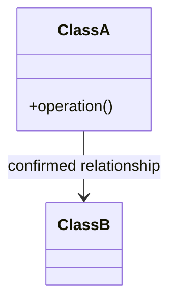
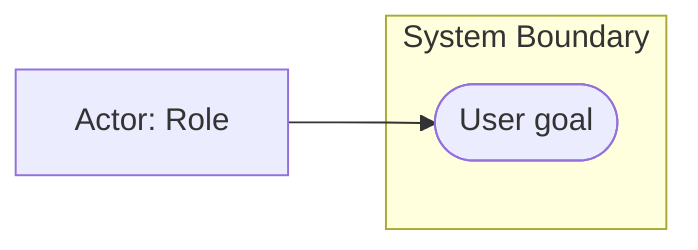
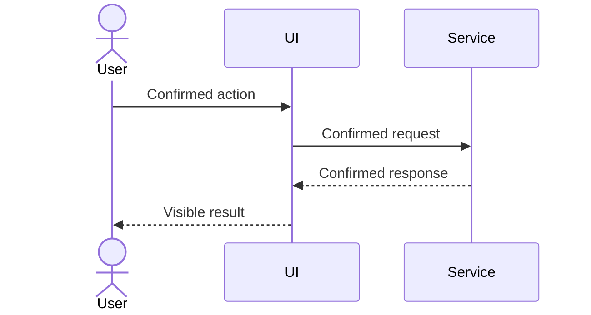
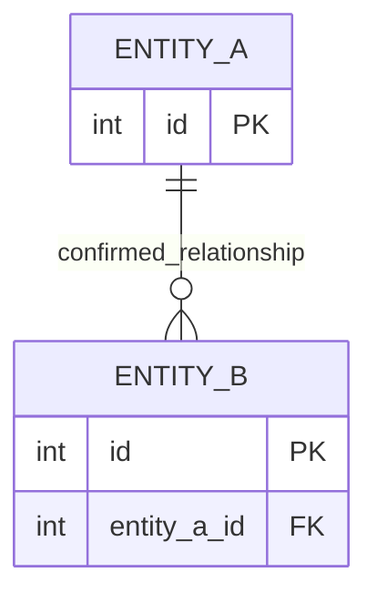
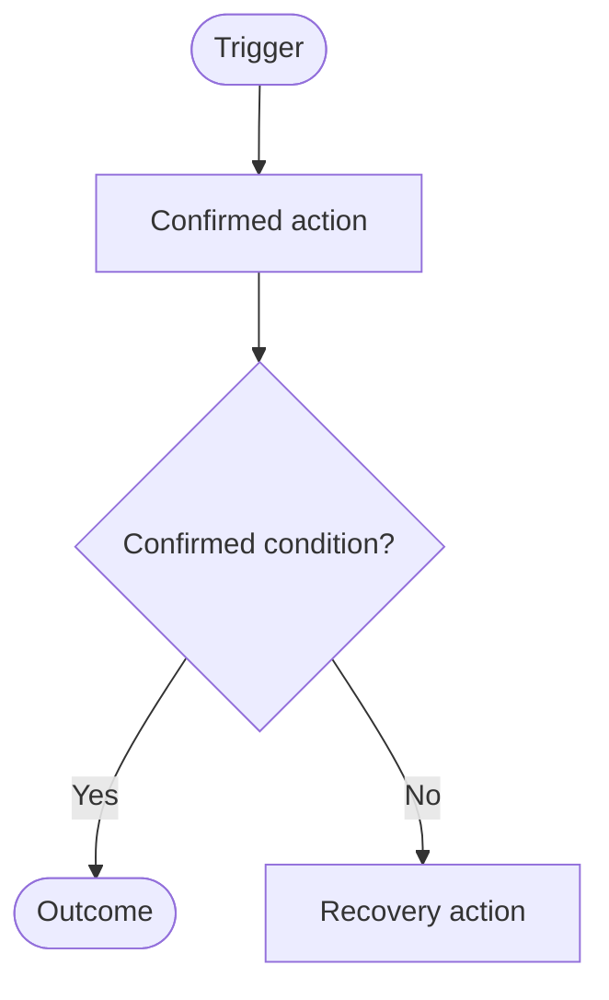
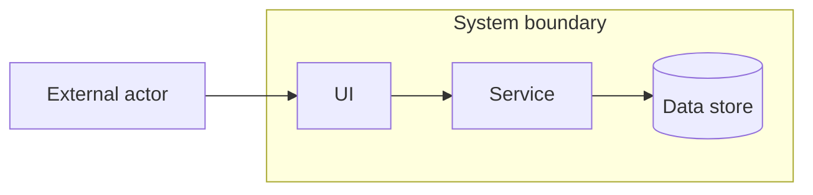
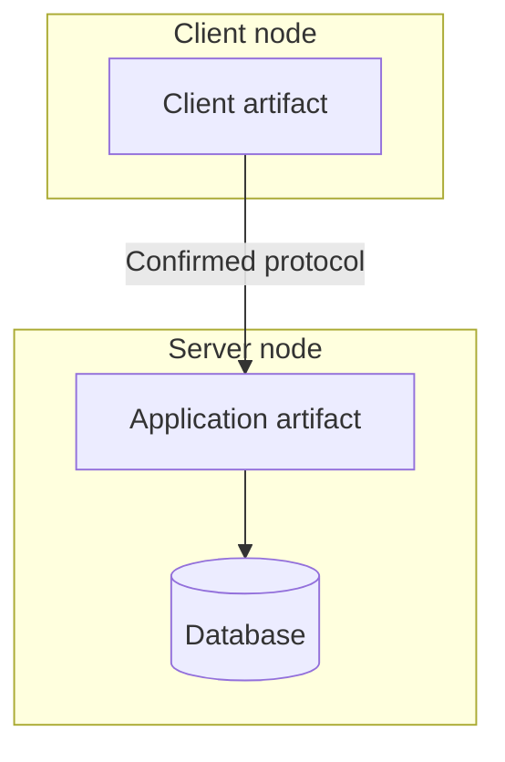

# Mermaid Templates

Replace placeholders only with confirmed project facts.

## Class Diagram

## Use Case Approximation

Mermaid has no native UML use-case syntax. Use a labeled flowchart or choose PlantUML for formal notation.

## Sequence Diagram

## ERD

## Flowchart

## Architecture Diagram

## Deployment Diagram

