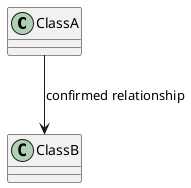
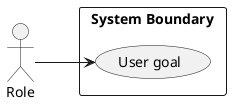
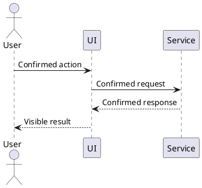
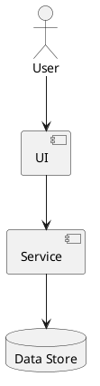
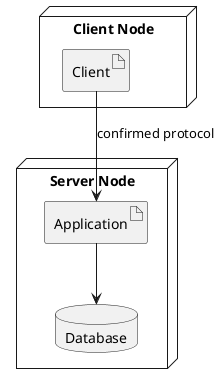

# PlantUML Templates

Replace placeholders only with confirmed project facts.

## Class Diagram

```plantuml
@startuml
class ClassA
class ClassB
ClassA --> ClassB : confirmed relationship
@enduml
```

## Use Case Diagram

```plantuml
@startuml
left to right direction
actor "Role" as Actor
rectangle "System Boundary" {
  usecase "User goal" as UC1
}
Actor --> UC1
@enduml
```

## Sequence Diagram

```plantuml
@startuml
actor User
participant UI
participant Service
User -> UI : Confirmed action
UI -> Service : Confirmed request
Service --> UI : Confirmed response
UI --> User : Visible result
@enduml
```

## Component Diagram

```plantuml
@startuml
actor User
component "UI" as UI
component "Service" as Service
database "Data Store" as DB
User --> UI
UI --> Service
Service --> DB
@enduml
```

## Deployment Diagram

```plantuml
@startuml
node "Client Node" {
  artifact "Client" as Client
}
node "Server Node" {
  artifact "Application" as App
  database "Database" as DB
}
Client --> App : confirmed protocol
App --> DB
@enduml
```
