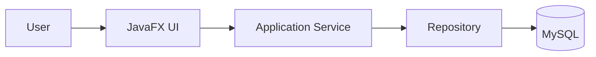

# Meister Weaver Quick Diagram Plan

## Diagram Needed
- Layered runtime architecture diagram.

## Objective
- Explain the confirmed UI-to-database request path for maintainers.

## Inputs Required
- Runtime entrypoint, service wiring, repository implementation, and database configuration.

## Recommended Format
- Mermaid

## Draft Diagram

## Missing Evidence
- Authentication boundary
- External services
- Deployment topology
