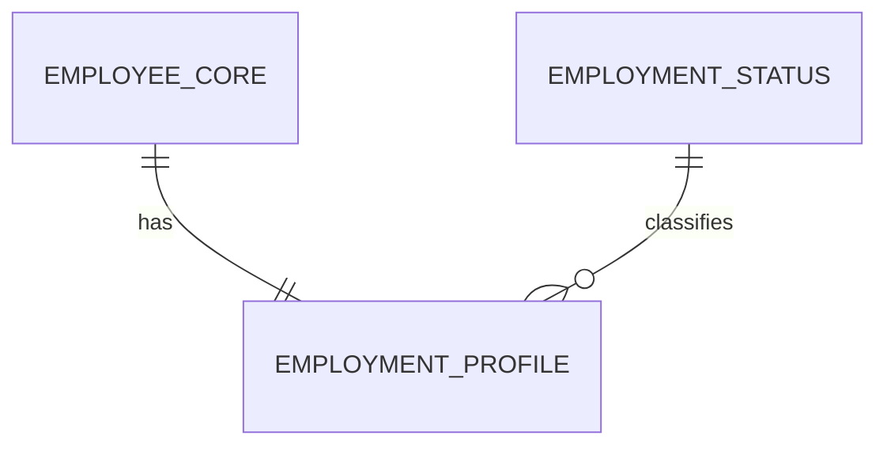

# Weaver Quick Diagram Plan

## Diagram Needed
- Logical ERD for employee and employment profile data.

## Objective
- Show the confirmed one-to-one relationship and status reference.

## Inputs Required
- Schema definitions and foreign-key constraints.

## Recommended Format
- Mermaid

## Draft Diagram

## Missing Evidence
- Key column names
- Optionality rules
- Referential actions
