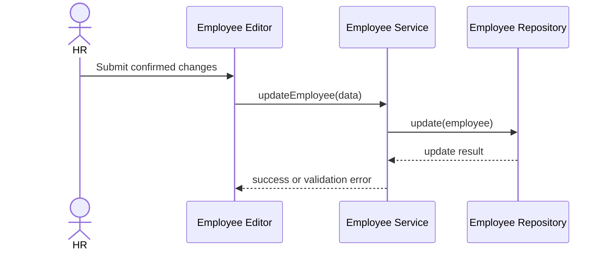

# Meister Weaver Quick Diagram Plan

## Diagram Needed
- Sequence diagram for employee update.

## Objective
- Document the confirmed request and persistence order.

## Inputs Required
- Controller, service, repository, and database call path.

## Recommended Format
- Mermaid

## Draft Diagram

## Missing Evidence
- Transaction boundary
- Database failure behavior
- Audit logging behavior
