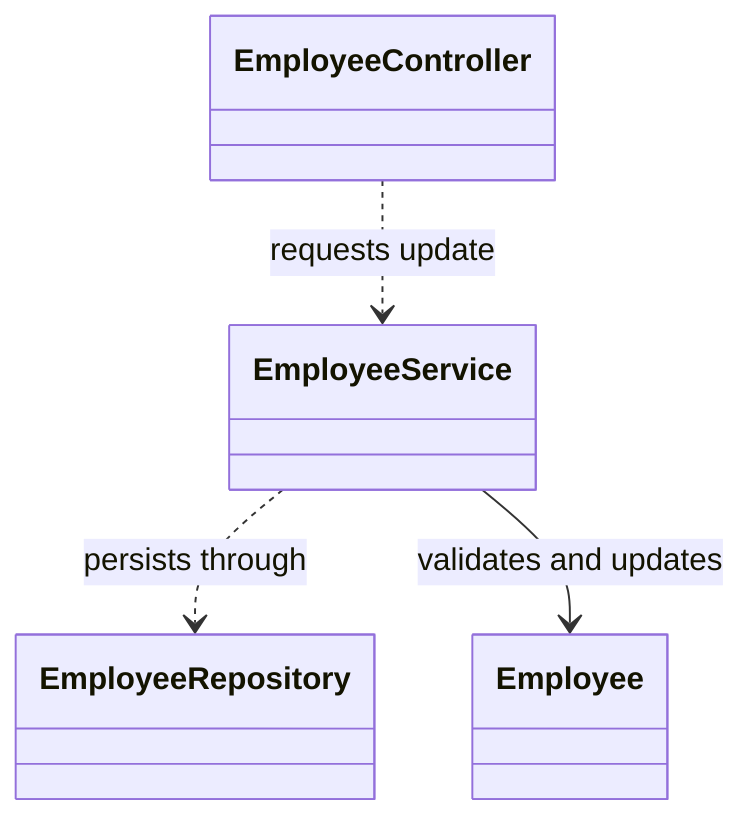

# Weaver Quick Diagram Plan

## Diagram Needed
- UML class diagram for an employee update path.

## Objective
- Show confirmed responsibilities and dependencies among the controller, service, repository, and employee entity.

## Inputs Required
- Class declarations and update method signatures.

## Recommended Format
- Mermaid

## Draft Diagram

## Missing Evidence
- Concrete repository implementation
- Method visibility and return types
- Transaction ownership
