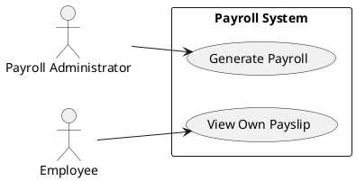

# Meister Weaver Quick Diagram Plan

## Diagram Needed
- UML use case diagram for payroll access.

## Objective
- Show which confirmed roles can generate and view payroll records.

## Inputs Required
- Approved role-permission requirements.

## Recommended Format
- PlantUML

## Draft Diagram

## Missing Evidence
- Whether HR shares payroll-administrator permissions
- Whether payslip download is a separate user goal
